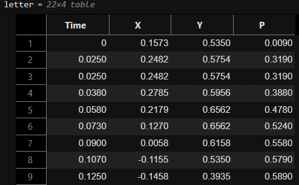
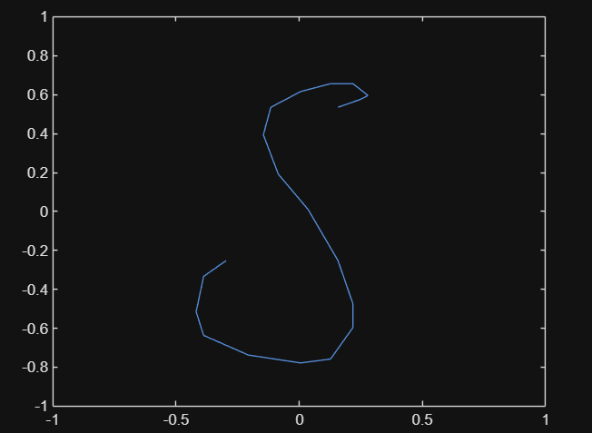
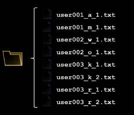
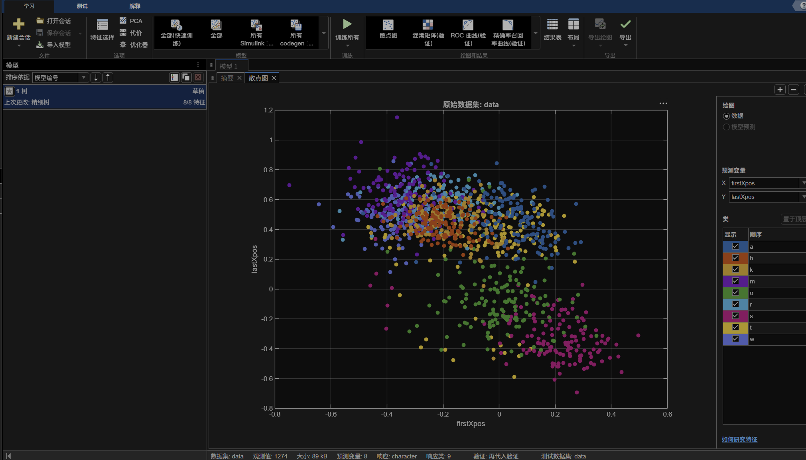
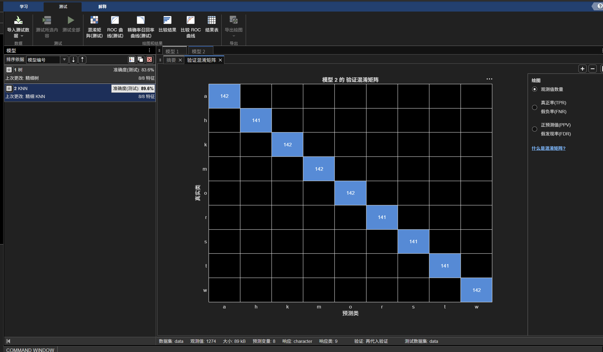
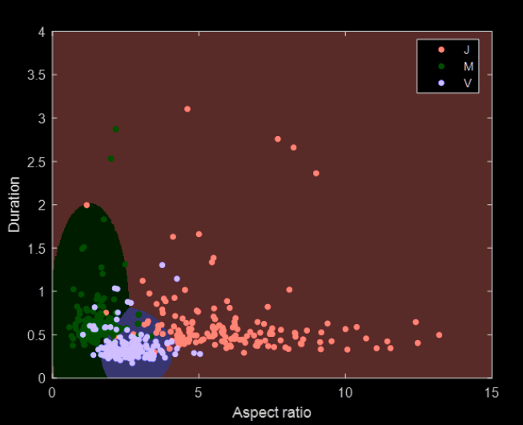
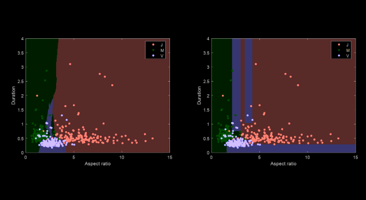
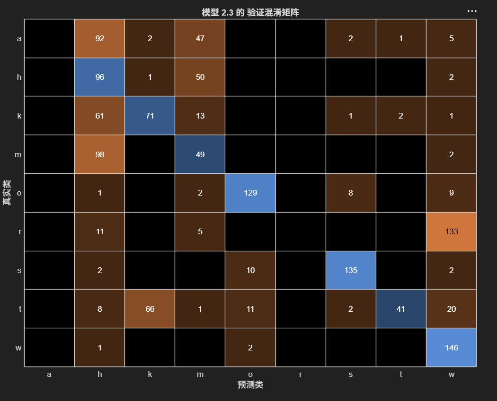
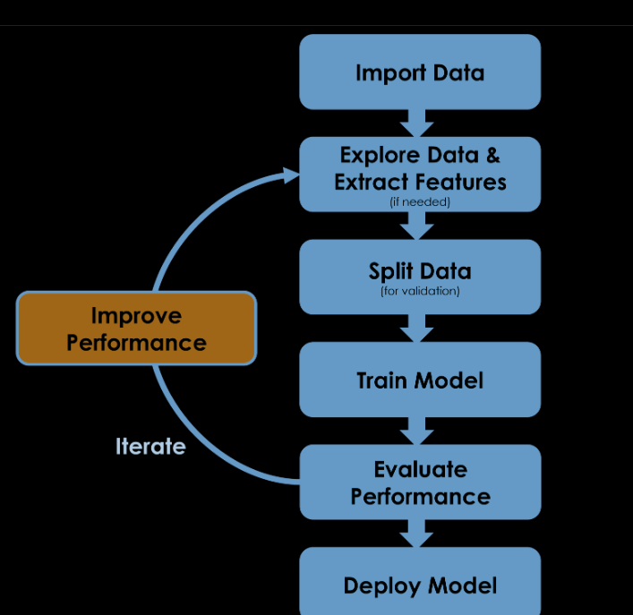

# 导入数据

## 导入字母

```matlab
letter = readtable("s.txt")
plot(letter.X,letter.Y)
axis([-1 1 -1 1])
```



## 导入多个字母

以上是字母的单个文件，实际上训练数据的组织方式是不同的。在这个案例中数据的组织方式如下：


```matlab
letterds = datastore("user*_r_*.txt")
data = read(letterds) % read是一个类似迭代器的东西，每次读入的是下一个文件
plot(data.X,data.Y)
axis([-1 1 -1 1])

data = readall(letterds) % 如果想要获得所有文件，使用readall
plot(data.X,data.Y)
axis([-1 1 -1 1])

```

# 提取特征

机器学习算法需要大量的观测值，每个观测值应包含若干的特征。

要应用机器学习算法，首先需要将原始数据变换为一组特征。

## 提取字母特征

什么算是一个字母的特征呢？

有的字母写的时间长，有的短，时间可以是一个特征；有的字母比较长（l），有的比较扁（m），长和宽也可以作为特征；有的字母一笔完成（o），有的可能需要两笔（t），笔画数量也是一个特征。

```matlab
timeToWrite = letter.Time(end)
letterHeight = range(letter.Y)
letterWidth = range(letter.X)
numStrokes = sum(ismissing(letter.P))
features = table(timeToWrite,letterWidth,letterWidth)
```

## 从多个文件中提取特征

```matlab
ls("*.txt")

letterds = datastore("*.txt")

featds = transform(letterds,@extractLetterFeatures)

data = readall(featds)

c = extractBetween(letterds.Files,"_","_")

data.character = categorical(c)
```

# 拆分数据以进行验证



训练与验证



## 交叉验证

在 k 折交叉验证中，数据随机拆分为 k 组，这些组称为折。其中一折保留为验证集以测量性能，而其余数据用于训练。然后，该过程重复进行，每次保留一个不同折用于验证，直到所有折都用作一次验证集。所有折的平均准确度即为验证准确度。

# 分类模型

分类模型指将特征空间划分为若干区域，并将每个区域标注为所需的输出类别之一。如何确定划分方式？通过获取训练数据并应用一个称为机器学习方法的给定过程来确定。这里机器学习方法可以看作一个描述如何从给定数据生成模型的方案。



平面的划分并没有绝对“正确”的方式。不同分类算法会导致不同划分方式。



## 超参数

# 评估模型性能

准确度、训练时间、混淆矩阵（每个格子表示被分类的类型数量）



# 模型的改进

可以从下图的任一一个方面进行改进以获得更高性能的模型。


- 采集更多、更准确的样本
- 查找和删除对提高模型性能帮助不大的特征，变换和减少特征数量，同时保留数据中的相关信息
- 根据可用的数据量和计算资源，决定使用训练集和测试集，或使用交叉验证
- 选择合适的模型和超参数
- 根据不同场景考虑不同的评估方式，比如假正率和假负率

# 总结

以上介绍的是分类，如果要预测的输出是数值，例如房屋价格，则属于回归而不是分类。许多用于分类的机器学习方法经调整可用于回归。无论采用哪种方式，构建这些类型的预测模型都称为有监督学习。“有监督”指基于已知正确输出的示例训练模型。

对于某些应用，如图像、语音和文本，提出理想的特征具有挑战性。这时可以采用深度学习，深度学习是一种特定的机器学习方法，它使用神经网络来提取特征并进行预测。

