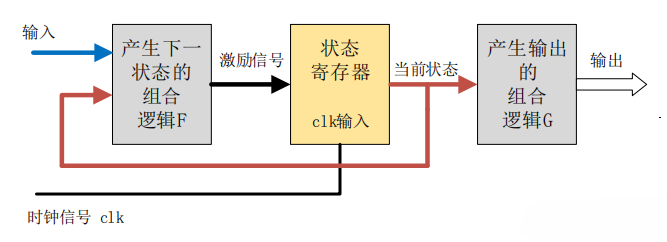
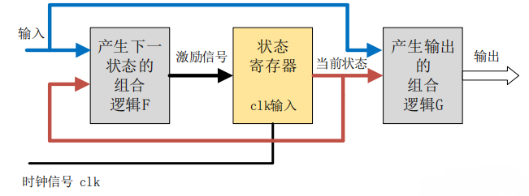

> [NOTE]
> HDLbits好像不保存代码，注意保存（被坑了！！！）

# 状态机

有限状态机（Finite-State Machine，FSM），是表示有限个状态以及在这些状态之间的转移和动作等行为的数学模型，在电路设计上有广泛的用处。

## Moore型状态机


Moore型状态机的输出只与当前的状态有关，也就是说当输入发生变化时，只要没有到下一个时钟周期（状态没有改变），输出也就保持不变，Moore型状态机的输入和输出是隔离的。

```Verilog
assign output = (state == target)?1:0; //典型组合逻辑
```

## Mealy型状态机



Mealy型状态机不仅与当前状态有关，也和输入有关，当输入发生变化时，状态机的输出会立刻发生变化，同种逻辑下，Mealy 型状态机输出对输入的响应会比 Moore 型状态机早一个时钟周期。

```Verilog
assign output = (state == target && input)?1:0; //典型组合逻辑
```

## 状态机设计三段式

- 根据状态个数确定状态机编码
```verilog
parameter STATE_01 = 2'b00;
parameter STATE_02 = 2'b01;
parameter STATE_03 = 2'b10;
parameter STATE_04 = 2'b11;
```
- 状态机第一段，时序逻辑，非阻塞赋值，传递寄存器的状态。
```verilog
always @(posedge clk or negedge rstn) begin
        if (!rstn) begin
            st_cur      <= 'b00 ;
        end
        else begin
            st_cur      <= st_next ;
        end
    end
```
- 状态机第二段，组合逻辑，阻塞赋值，根据当前状态和当前输入，确定下一个状态机的状态。
```verilog
always @(*)begin
    case(st_cur)
        STATE_01:
            if(...)
                st_next = ...
    ...
end
```
- 状态机第三段，时序逻辑，根据当前状态（当前输入），确定输出信号。 
```verilog
//非阻塞型（Mealy）
reg output_r;
always @(posedge clk) begin
    if(...&&)
        output_r <= ...
    ...
end
assign output = output_r;
```
```verilog
//阻塞型（Moore）
reg output_r;
always @(*) begin
    if(...)
        output_r <= ...
    ...
end
assign output = output_r;
```


# [Lemmings](https://hdlbits.01xz.net/wiki/Lemmings4)

简单的状态机

```Verilog
module top_module(
    input clk,
    input areset,    // Freshly brainwashed Lemmings walk left.
    input bump_left,
    input bump_right,
    input ground,
    input dig,
    output walk_left,
    output walk_right,
    output aaah,
    output digging ); 

parameter LEFT = 0,
          RIGHT = 1,
          FALL = 2,
          DIG = 3;
reg [1:0] state, next_state;
reg [1:0] fall_dir;
reg flag;
integer count = 0;
always @(*) begin
    next_state = state;
    case(state)
        LEFT:
            if(!ground)
                next_state = FALL;
            else if(dig)
                next_state = DIG;
            else if(bump_left)
                next_state = RIGHT;
        RIGHT:
            if(!ground)
                next_state = FALL;
            else if(dig)
                next_state = DIG;
            else if(bump_right)
                next_state = LEFT;
        FALL:
            if(ground)
                next_state = fall_dir;
        DIG:
            if(!ground)
                next_state = FALL;
    endcase
end

always @(posedge clk,posedge areset) begin
    if(areset) begin
        state <= LEFT;
        fall_dir <= LEFT;
        flag <= 0;
        count <= 0;
    end
    else begin
        if(state == FALL)
            count <= count + 1;
            if(count >= 20 && next_state != FALL)
                flag <= 1;
            else if(next_state != FALL)
                count <= 0;
        if(next_state == FALL || next_state == DIG)
            if(state == LEFT || state == RIGHT)
                fall_dir <= state;
        state <= next_state;
    end
end

assign walk_left = flag ? 0 : (state == LEFT);
assign walk_right = flag ? 0 : (state == RIGHT);
assign aaah = flag ? 0 : (state == FALL);
assign digging = flag ? 0 : (state == DIG);
endmodule

```

# [PS2](https://hdlbits.01xz.net/wiki/Fsm_ps2data)

写成两段式了...

```Verilog
module top_module(
    input clk,
    input [7:0] in,
    input reset,    // Synchronous reset
    output [23:0] out_bytes,
    output done); //

    parameter R0=0,R1 = 1,R2 = 2,R3 = 3;
    reg [1:0] state, next_state;
    // State transition logic (combinational)
    reg [23:0] buffer;
    always @(posedge clk) begin
        if(reset)begin
            state <= R0;
        end
        else begin
            if(state == R0 && in[3] == 1)begin
                state <= R1;
                buffer <= {in[7:0],buffer[15:0]};
            end
            else if(state == R1)begin
                state <= R2;
                buffer <= {buffer[23:16],in[7:0],buffer[7:0]};
            end
            else if(state == R2) begin
                state <= R3;
                buffer <= {buffer[23:8],in[7:0]};
            end
            else if(state == R3 && in[3] == 0)begin
                state <= R0;
                buffer <= 24'b0;
            end
            else if(state == R3 && in[3] == 1)begin
                state <= R1;
                buffer <= {in[7:0],buffer[15:0]};
            end
        end
    end
    // State flip-flops (sequential)
    // always @(*) begin
    //     next_state = state;
    //     case(state)
    //         R0:
    //             if(in[3] == 1)
    //                 next_state = R1;
    //             else
    //                 next_state = R0;
    //         R3:
    //             if(in[3] == 1)
    //                 next_state = R1;
    //             else
    //                 next_state = R0;
    //     endcase
    // end

    // Output logic
    assign done = (state == R3) ? 1 : 0;
    assign out_bytes = buffer;
endmodule

```

# [Serial](https://hdlbits.01xz.net/wiki/Fsm_serialdp)

阻塞或非阻塞，这是个问题。

```verilog
module top_module(
    input clk,
    input in,
    input reset,    // Synchronous reset
    output [7:0] out_byte,
    output done
); 
parameter IDLE = 0, START = 1, DATA = 2, STOP = 3,ERR = 4;
reg [2:0] state, next_state;
integer count = 0;
reg [7:0] buffer;
reg [8:0] check;
reg flag;
always @(posedge clk) begin
    if (reset) begin
        state  <= IDLE;
        count  <= 0;
        buffer <= 0;
        check  <= 0;
        flag   <= 0;
    end else begin
        if (state == DATA || state == START) begin
            if (count < 9) begin                    
                if(count < 8)
                    buffer <= (buffer >> 1) | (in << 7);      
                if(count == 8)begin
                    check = {in,buffer};
                    flag  = ^check;
                end
                count  <= count + 1;
            end
        end else begin
            count  <= 0;
            buffer <= 0;   
        end
        state <= next_state;
    end
end

always @(*)begin
    next_state = state;
    case(state)
        IDLE:
            if(in == 0)
                next_state = START;
        START:
            next_state = DATA;
        DATA:
            if(in == 1 && count == 9)
                next_state = STOP;
            else if(count >=9)
                next_state = ERR;
        STOP:
            if(in == 0)
                next_state = START;
            else
                next_state = IDLE;
        ERR:
            if(in == 1)
                next_state = IDLE;
            else
                next_state = ERR;
    endcase
end

assign done = flag && (state == STOP) && (count == 9);
assign out_byte = buffer;
endmodule

```