# 逻辑门

## 非门

一个CMOS电路就是一个非门，当输入A为1时，PMOS截止，NMOS导通，Y与地相连，输出为0.

## 与非门

与非门要求输入均为1时输出为0，其余情况输出为1。那么输入为1时是“与”特性，可以用两个NMOS串联接地，这样输入均为1时满足输出为0。对于其余情况可以知道，只要有一个是0，那么输出就为1，这是“或”的特性，可以用两个PMOS并联接VCC。

## 与门

将与非门的输出连接到非门的输入即可。

> 尝试分析以下门电路的行为和功能.
> 

可以使用真值表枚举分析功能。也可以从图中可以看出N1N2是并联型NMOS，当AB任一为1时导通，此时Y输出为0，P1P2是串联型PMOS，当AB均为0时Y输出为1。所以这是一个或非门。

> 尝试画出或门的晶体管结构

将上述或非门电路输出连接一个CMOS电路即可。

## 三输入与非门

对于N输入与门（或门），需要N-1个与门（或门）进行输入口的两两级联即可。与非门和或非门同理。

> 不难分析, 上述晶体管结构同样实现了三输入与非门的功能. 尝试对比两种实现方式中所需晶体管的数量.

对于第一种电路，一个与门是6个晶体管，与非门是4个，一共使用了10个，第二种则是根据需求直接定制的电路，只使用了6个。全定制电路可以使用更少的晶体管，但是定制过程会相对复杂。

## 异或门

异或门的逻辑是相同则为0，不同则为1。写成逻辑表达式为 $ F = A \overline{B} + \overline{A} B $。

> 尝试在Logisim中用上文提到的门电路搭建一个异或门. 搭建后, 通过仿真检查你的方案是否正确.实现正确后, 计算你的方案使用了多少个晶体管.

根据逻辑表达式画出的异或门，共使用2+2+6+6+6=22个晶体管。
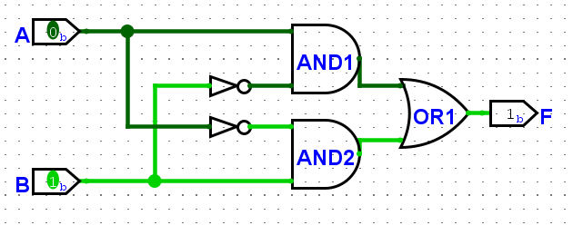

> 还有另一种操作是"同或"操作, 当输入A和B相同时, 结果为1, 否则为0. 同或操作可以认为是异或操作结果的取反.尝试在Logisim中用上文提到的门电路搭建一个同或门. 搭建后, 通过仿真检查你的方案是否正确.

在异或门的基础上取反即可。
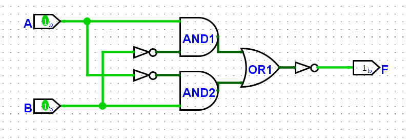

# 组合逻辑电路

## 译码器

译码器用于将二进制转化为第几个十进制。

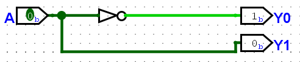

这是一个1-2译码器。

> 尝试在Logisim中用门电路搭建一个2-4译码器, 它有2位输入, 4位输出. 搭建后, 通过仿真检查你的方案是否正确.

为了使得能够顺利级联，给1-2译码器加入使能端。
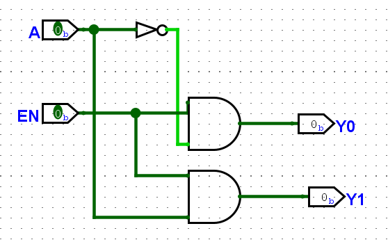

进行级联得到2-4译码器。
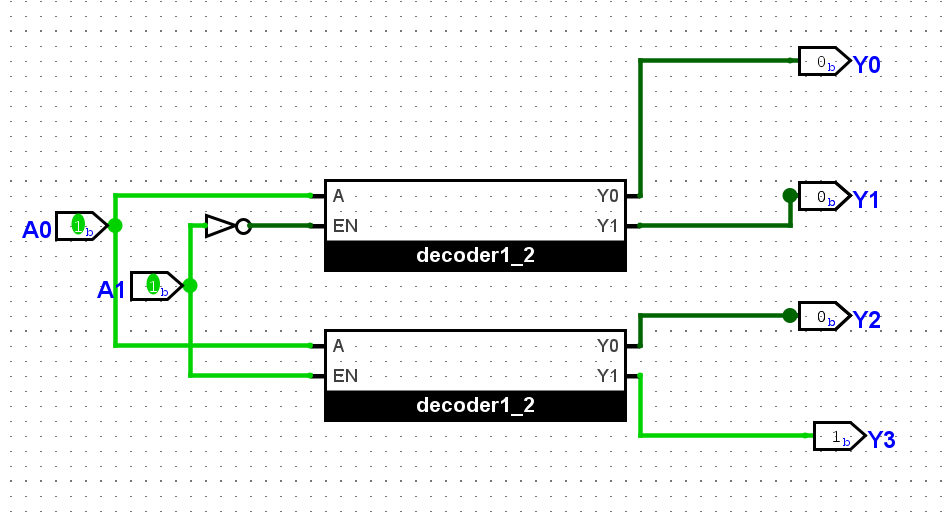

> 3-8译码器有3位输入, 8位输出. 尝试实例化若干个2-4译码器(具体数量交给你的思考), 并添加少量门电路, 从而实现3-8译码器的功能. 搭建后, 通过仿真检查你的方案是否正确.

38译码器同理
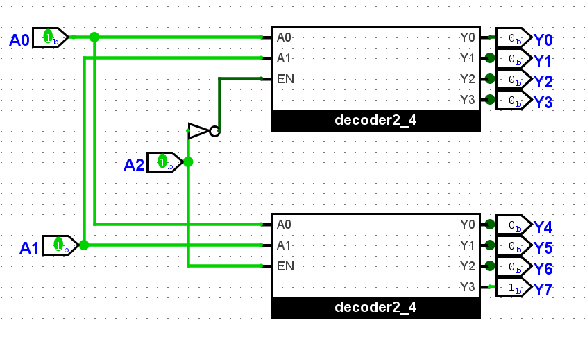

> 尝试在Logisim中通过门电路搭建一个支持十六进制数字的七段数码管译码器. 和上述的十进制数字相比, 当输入对应10-15时, 七段数码管分别显示A, b, C, d, E, F. 搭建后, 通过仿真检查你的实现是否正确.

| 数值 | 对应段码 |
|---|---|
| 0 | 01111110 |
| 1 | 00010010 |
| 2 | 10111100 |
| 3 | 10110110 |
| 4 | 11010010 |
| 5 | 11100110 |
| 6 | 11101110 |
| 7 | 00110010 |
| 8 | 11111110 |
| 9 | 11110110 |
| 10 | 11111010 |
| 11 | 11001110 |
| 12 | 01101100 |
| 13 | 10011110 |
| 14 | 11101100 |
| 15 | 11101000 |
| 其他 | 00000001 |

可以使用如下的思路设计：对于某一位段码，只有特定数值才会亮，这是一个或关系，因此可以使用译码器将不同数值或在一起连在对应的段上。

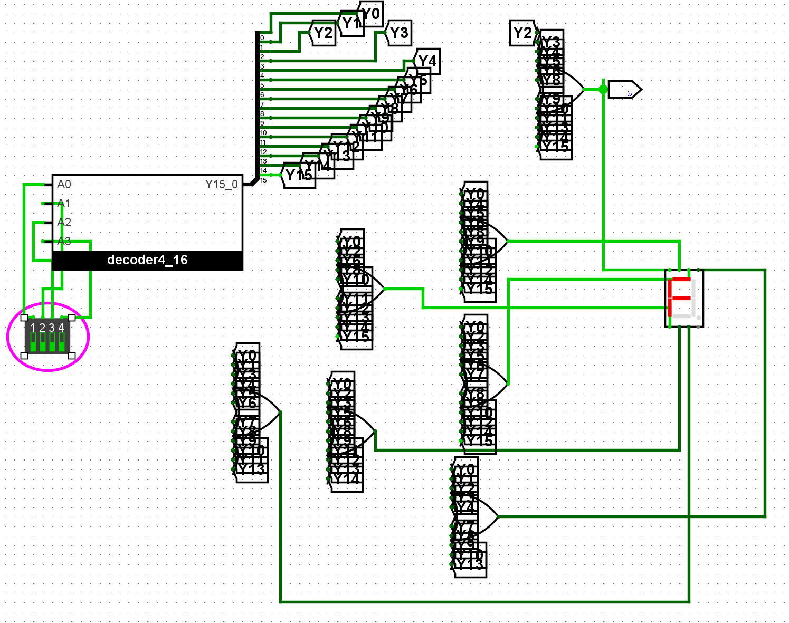

对于当输入对应0-9时, 七段数码管显示对应的数字; 对于其他输入, 七段数码管只显示小数点的要求，只需要将接了Y10及以上的输入用0代替，增加一个或门将Y10以及上连接在一起接到dp上。

## 编码器

编码器则相反，将第几个十进制转化为二进制

> 尝试在Logisim中通过门电路搭建一个16-4编码器, 它有16位输入和4位输出, 分别与拨码开关和七段数码管译码器相连, 使得编码器的输出结果通过十六进制数字显示在七段数码管中. 搭建后, 通过仿真检查你的实现是否正确.

| A15~A0 | Y3~Y0 |
| ------ | ----- |
| 0000000000000001 | 0000 |
| 0000000000000010 | 0001 |
| 0000000000000100 | 0010 |
| 0000000000001000 | 0011 |
| 0000000000010000 | 0100 |
| 0000000000100000 | 0101 |
| 0000000001000000 | 0110 |
| 0000000010000000 | 0111 |
| 0000000100000000 | 1000 |
| 0000001000000000 | 1001 |
| 0000010000000000 | 1010 |
| 0000100000000000 | 1011 |
| 0001000000000000 | 1100 |
| 0010000000000000 | 1101 |
| 0100000000000000 | 1110 |
| 1000000000000000 | 1111 |

通过真值表获得Y3~Y0的输出与输入的关系。

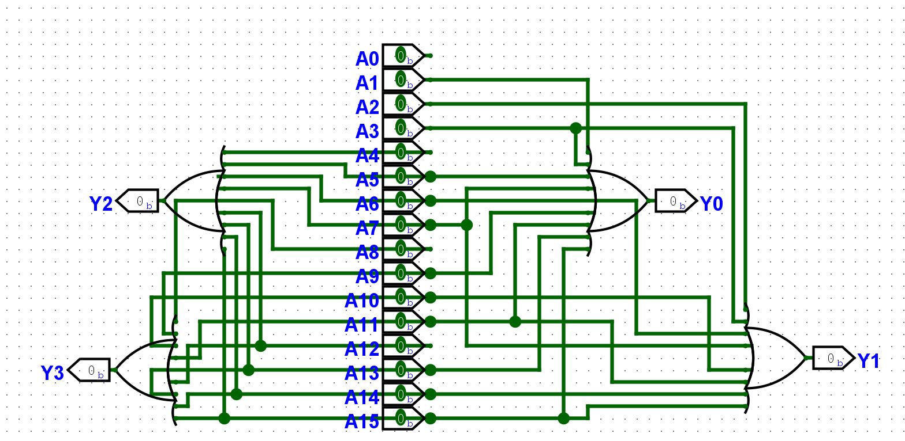

> 根据上述真值表, 尝试列出每一位输出的逻辑表达式. 然后尝试在Logisim中通过门电路搭建一个4-2优先编码器. 搭建后, 通过仿真检查你的方案是否正确.
实现后, 对比4-2编码器和4-2优先编码器所需的门电路数量.

优先编码器需要考虑占位情况，故需要更多门电路来排除这些情况。

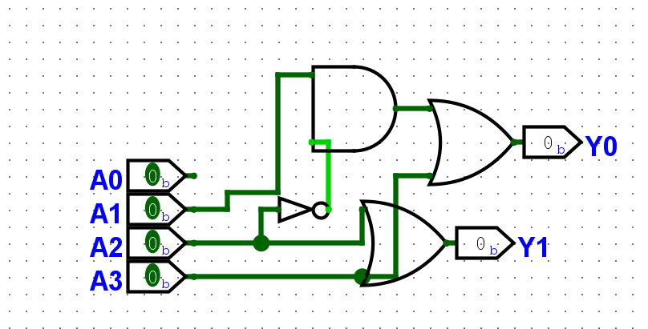

## 多路选择器

多路选择器用于选择不同端口的数据

> 尝试在Logisim中通过门电路搭建一个1位2选1选择器. 搭建后, 通过仿真检查你的方案是否正确.

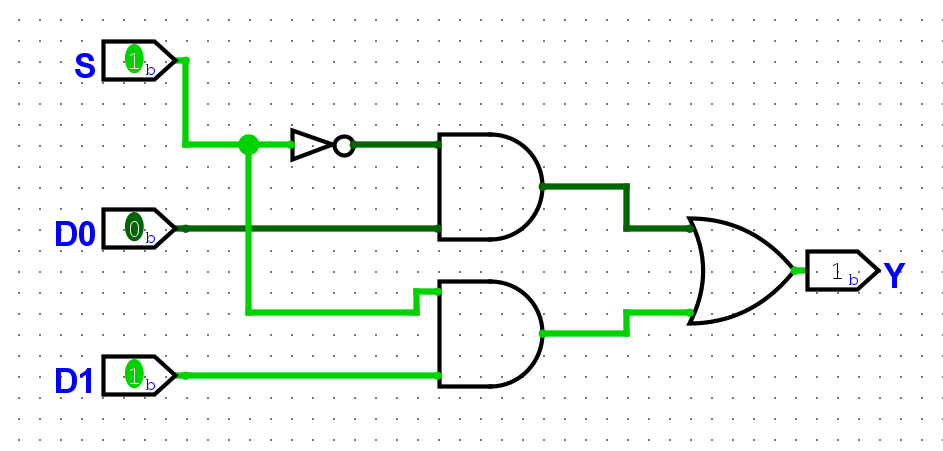

> 尝试画出3位4选1选择器的电路结构图, 然后在Logisim中通过门电路搭建一个3位4选1选择器. 搭建后, 通过仿真检查你的方案是否正确.

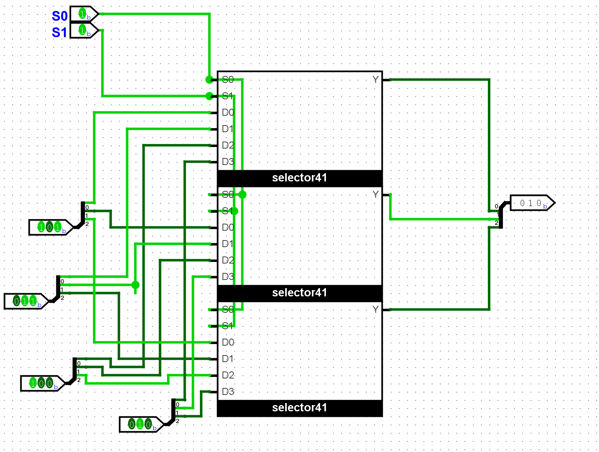

> 通过5个拨码开关和1个七段数码管, 实现如下功能: 其中4个拨码开关当作数据输入, 剩下1个拨码开关作为进位计数制的选择, 当选择信号为0时, 七段数码管以十进制方式显示数据; 当选择信号为1时, 七段数码管以十六进制方式显示数据. 在输入数据为10-15时, 两种显示方式有所不同.

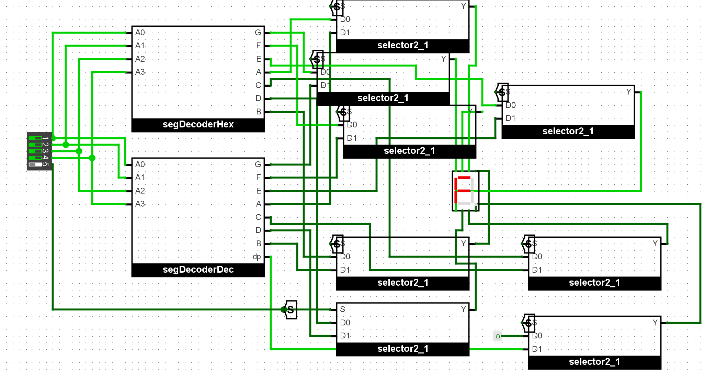

## 比较器

用于比较数值是否相同

> 尝试在Logisim中通过门电路搭建一个4位比较器, 然后通过两组拨码开关对比两组数据是否相等, 若相等, 则点亮一个LED灯. 搭建后, 通过仿真检查你的方案是否正确.

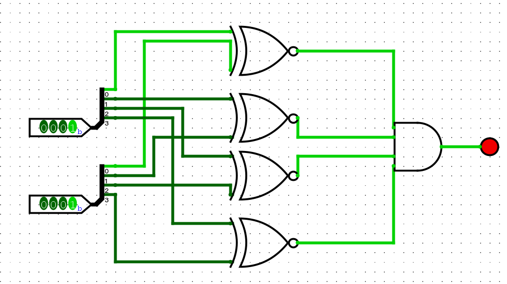

## 加法器

用于处理加法

> 尝试列出1位全加器的真值表, 并在Logisim中通过门电路搭建一个1位全加器. 搭建后, 通过仿真检查你的方案是否正确.

| A | B | Cin | S | Cout |
|-|-|-|-|-|
| 0 | 0 | 0 | 0 | 0 |
| 1 | 0 | 0 | 1 | 0 |
| 0 | 1 | 0 | 1 | 0 |
| 1 | 1 | 0 | 0 | 1 |
| 0 | 0 | 1 | 1 | 0 |
| 1 | 0 | 1 | 0 | 1 |
| 0 | 1 | 1 | 0 | 1 |
| 1 | 1 | 1 | 1 | 1 |

> 尝试在Logisim中通过门电路搭建一个4位加法器, 用七段数码管按十六进制显示加法器的两个输入和结果, 并用一个LED灯指示加法结果是否产生进位. 搭建后, 通过仿真检查你的方案是否正确.

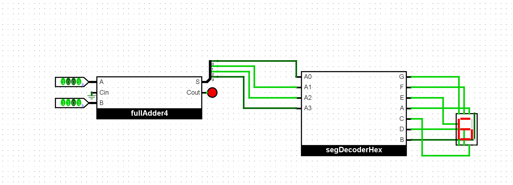

> 根据4位加法器的设计思路, 尝试在Logisim中通过门电路搭建一个4位减法器, 用七段数码管按十六进制显示减法器的两个输入和结果, 并用一个LED灯指示减法结果是否产生借位. 搭建后, 通过仿真检查你的方案是否正确.

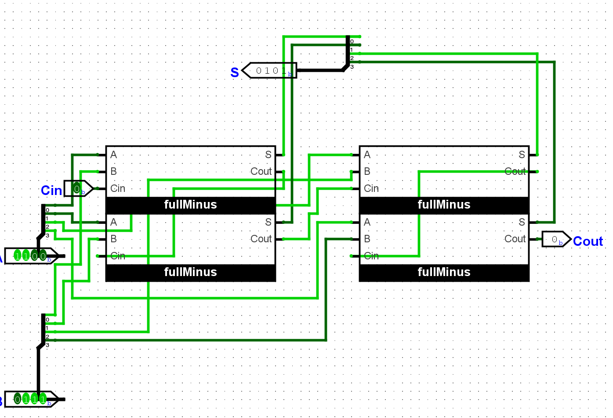

>理解原码加法器的工作原理后, 尝试用加法器, 减法器和多路选择器等部件, 在Logisim中搭建一个4位原码加法器. 为了显示符号位, 你可以额外实例化一个七段数码管, 结果为负数时显示负号-, 否则不显示. 搭建后, 通过仿真检查你的方案是否正确.

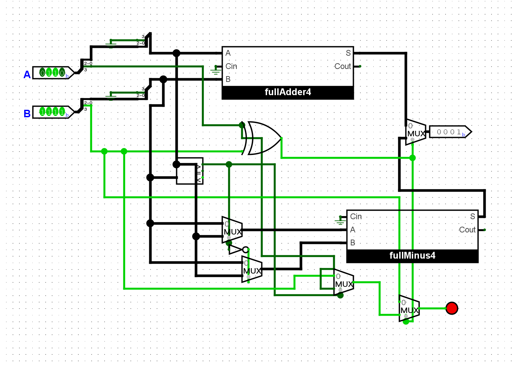

> 尝试按照上述思路, 在Logisim中搭建一个4位反码加法器. 搭建后, 通过仿真检查你的方案是否正确.
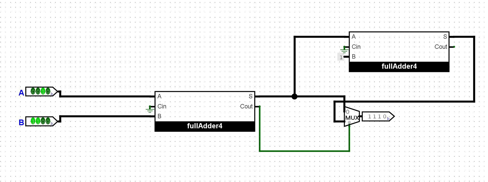

> 将上述真值表补充完整, 尝试列出溢出条件的逻辑表达式. 然后在Logisim中在4位加法器的基础上添加溢出判断逻辑. 添加后, 通过仿真检查你的方案是否正确.

显然补码加法溢出发生在两个加数符号相同，但是所得结果，也就是进位符号不同。因此逻辑表达式为 $ Cin \oplus Cout  $。

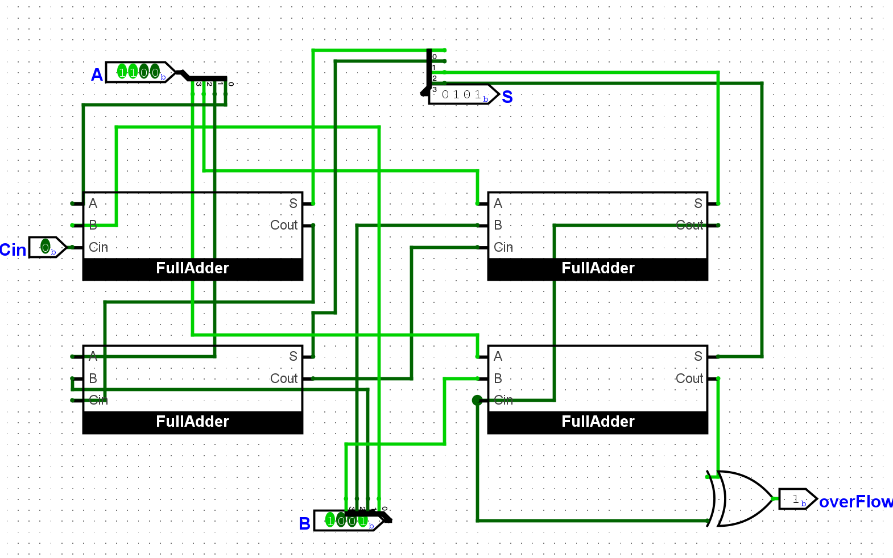

# 时序逻辑电路

时序逻辑电路可以记住当前电路状态，可以用于存储，状态机实现等等。
这类电路通常带有“反馈”信号。

## SR锁存器

SR锁存器中S为Set，即置位端，R为Reset，即复位端。通过置位端我们可以将电路的输出设置为我们想要的状态，随后通过一个特殊的“保存态”使得电路维持在上一个状态。

> 尝试在Logisim中通过门电路搭建一个SR锁存器. 搭建后, 通过仿真检查你的方案是否正确.

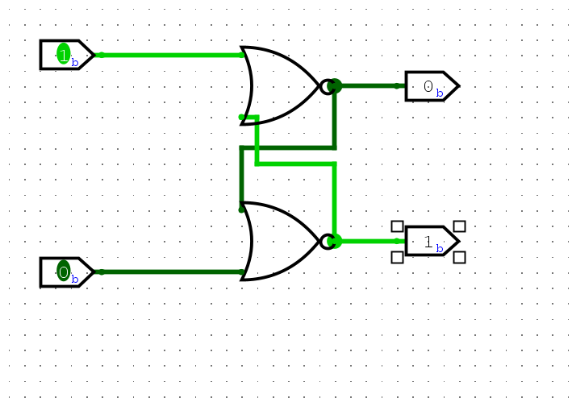

## D锁存器

对于SR锁存器来说，会出现一个S和R均为1的禁止态，这时候SR锁存器的输出逻辑不正常，另外可以发现，Reset这一端口其实没有必要。完全可以由一个Set来实现。
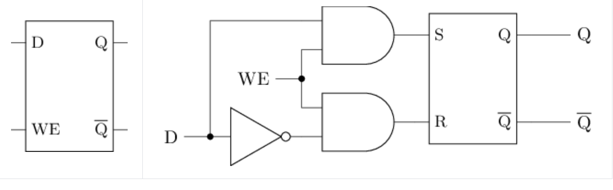
对于以上的D触发器，D端口用来设置数据，WE端口为写入使能。通过一个反相器避免了禁止态，同时通过写使能保护原有数据。

> 尝试为D锁存器添加一个用于复位的输入端和复位功能. 当复位信号有效时, D锁存器中存放的值将变为0.

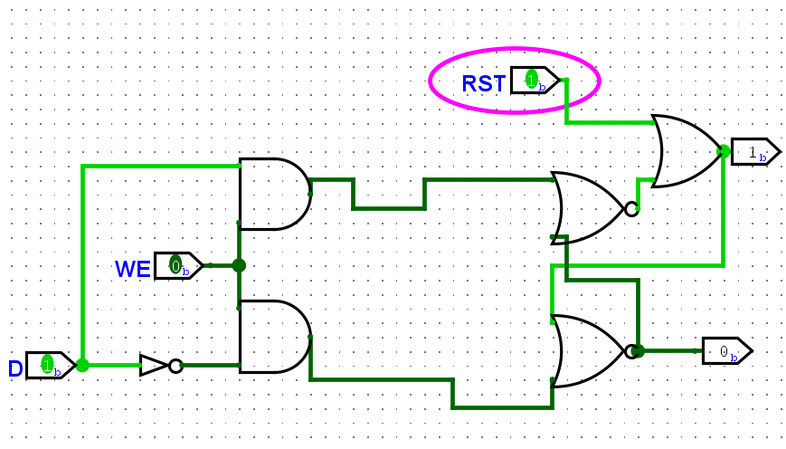

> 实例化一个带复位功能的D锁存器, 并将其输出取反后作为输入. 我们预期看到D锁存器的输出将在0和1之间反复变化, 但你应该在仿真过程中看到Oscillation apparent的信息, 请分析原因.

电路会在极短的时间内从0到1之间反复跳变发生震荡。

## D触发器

有时候我们希望电路是边沿敏感的，也就是当WE发生跳变时，电路产生特定变化，而电平稳定时，电路保持原有状态。当WE从0跳变到1，这时我们称之为上升沿。
下图为一种上升沿触发的D触发器，clk上升沿有效，此时Q=D。实现原理为当clk=0时，第一级D锁存器对D进行缓存，当clk跳变到1时，第一级保持，第二级进行输出。
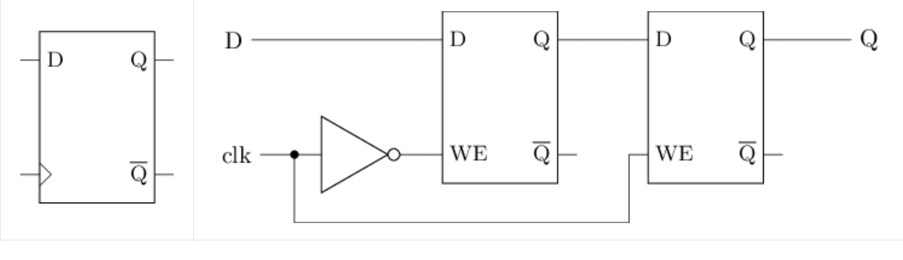

> 尝试为D触发器添加一个用于复位的输入端和复位功能. 当复位信号有效时, D触发器中存放的值将变为0.

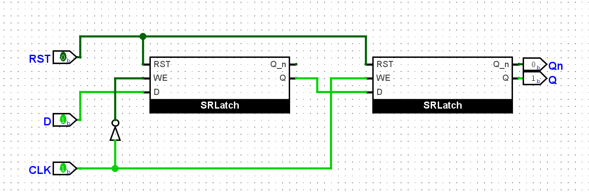

> 实例化一个带复位功能的D触发器, 并将其输出取反后作为输入. 我们预期看到D触发器的输出将在0和1之间反复变化. 尝试和上文D锁存器的结果进行对比.

对于触发器来说，在一个时钟周期内会发生一次跳变。

> 尝试在Logisim中通过D触发器和若干电路, 搭建一个带使能端的D触发器. 搭建后, 通过仿真检查你的方案是否正确.
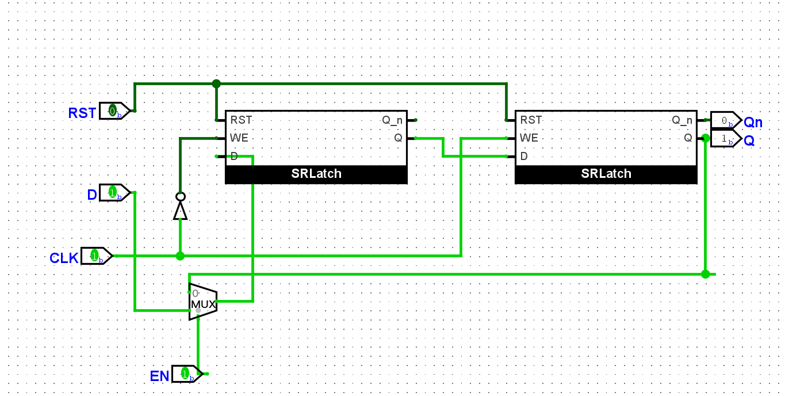

## 寄存器

简单来说上述一个D触发器就是一位锁存器，因为它已经拥有了存储一位数据所需的所有东西，当使能端有效时可以将数据在时钟上升沿时存入，使能端无效时对数据进行写保护，可以随时将数据取出。将D触发器进行并联拓展就可以实现多位的寄存器。

> 尝试在Logisim中通过D触发器搭建一个4位的寄存器, 具备复位功能. 搭建后, 尝试从拨码开关向寄存器写入4位数据, 并将寄存器的输出接到七段数码管进行显示.

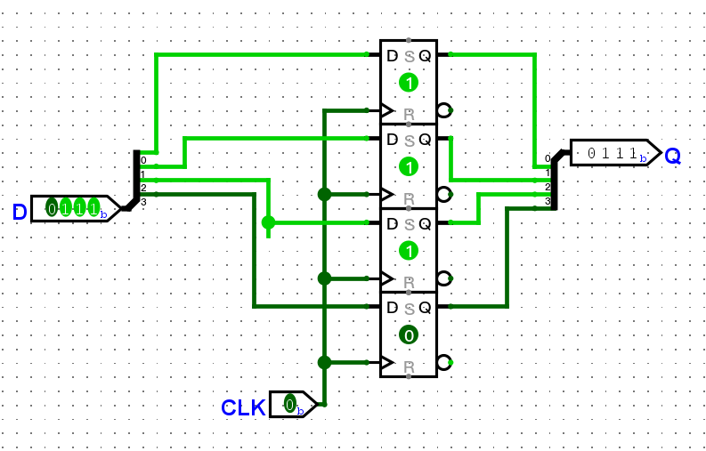

> 通过上述4位寄存器和之前搭建的加法器, 实现一个4位计数器, 每次时钟到来时, 寄存器中的值加1, 加到最大值时重新从0开始.

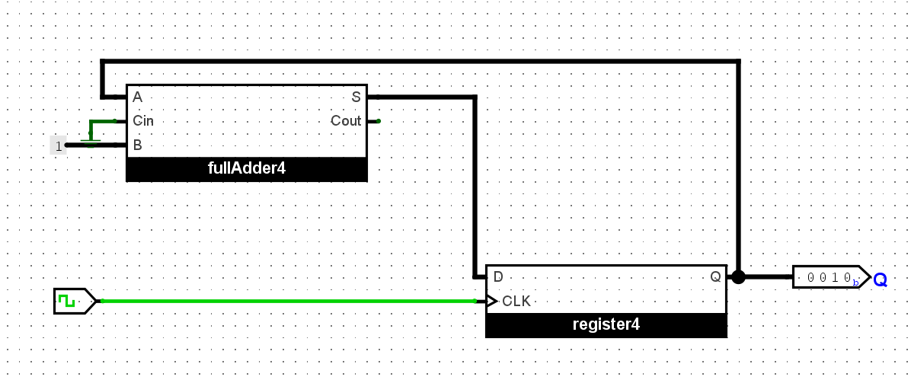

> 尝试通过寄存器和加法器, 计算出1+2+...+10的结果. 为了容纳计算结果, 你可以考虑实现8位的寄存器和加法器.

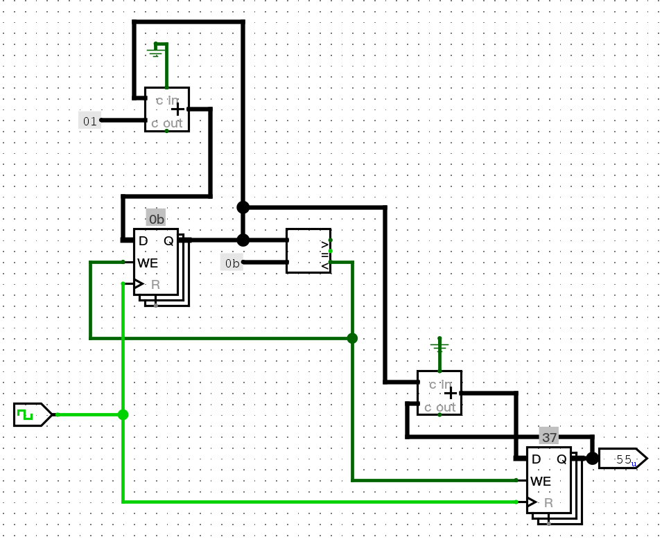

> 利用寄存器和七段数码管, 实现一个电子时钟, 具备"分"和"秒"的功能.

时钟需要每60个重置一次，也就是要实现一个模60计数器。

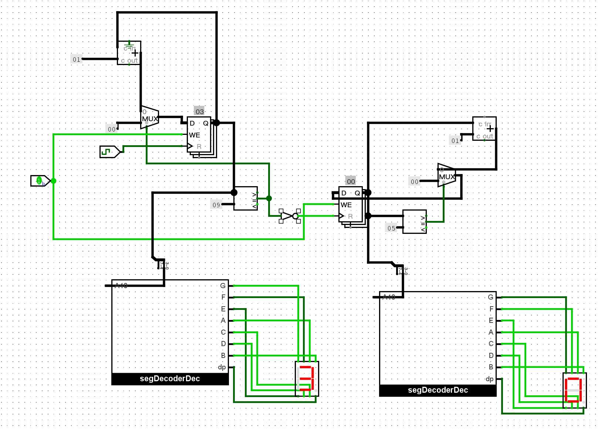

# F3

F3终于结束咯