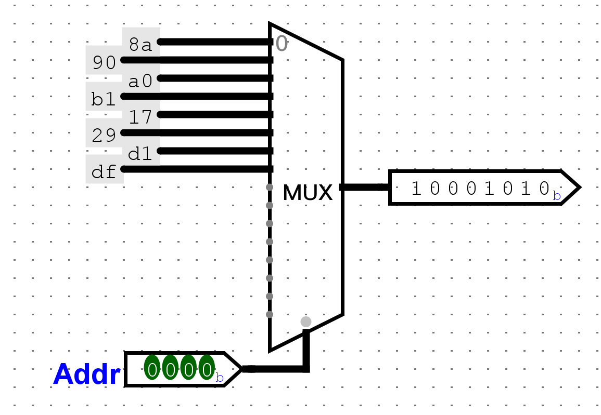
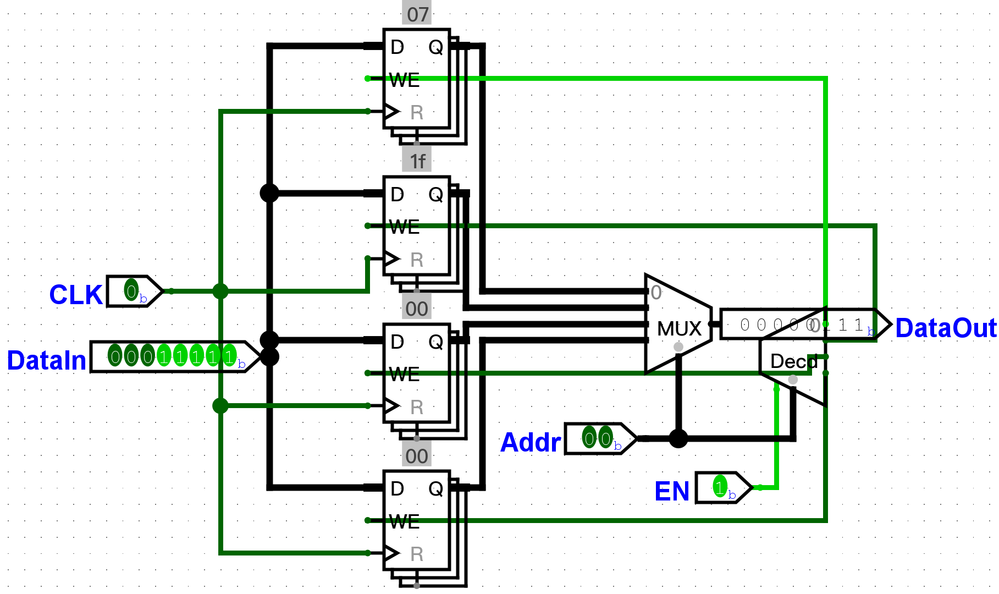
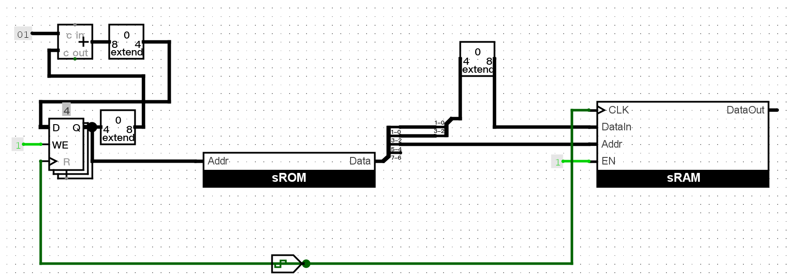
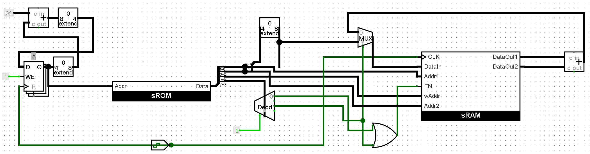
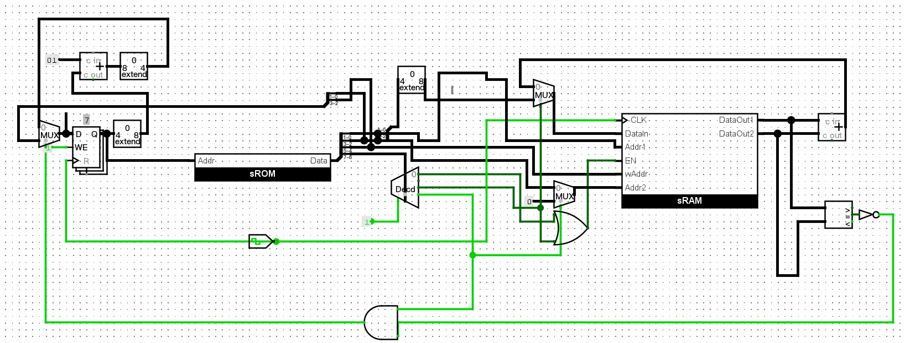
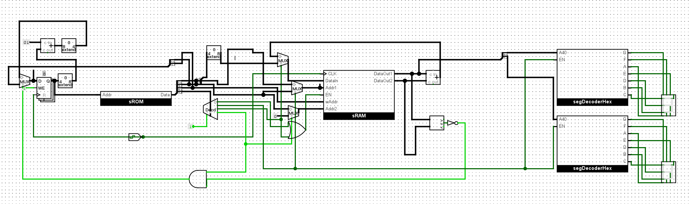

# 只读存储器（ROM）
我们将程序存储在ROM中。ROM的容量由地址数和数据位宽决定，比如256\*4bit，说明这个ROM数据位宽为4位，有256（2^8）个地址，地址端有8个。对于我们要实现的sCPU来说，PC位宽为4位，那么就需要4位的地址端，每条指令有8位，位宽为8，需要实现的规格为16\*8。
ROM其实就是根据地址选择不同的数据，因此就是一个数据选择器，可以通过一个16选1八位选择器得到。

# 随机存取存储器（RAM）
我们需要使用RAM来实现操作数的寄存器。寄存器的位宽应该为8，除此之外寄存器还需要具有可以根据地址获得输出以及根据地址可以进行写入的操作。

# 实现li

# 实现add

# 实现bner0

# 实现out

定义为01，`out rs`表示将R[rs]显示在数码管上。

