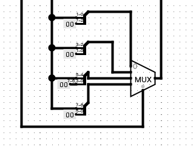
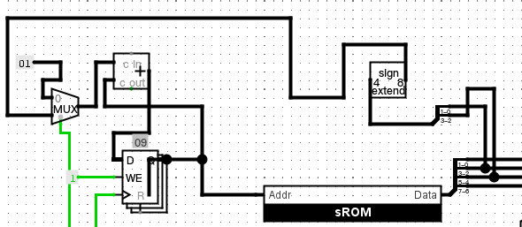
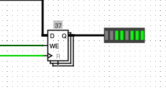
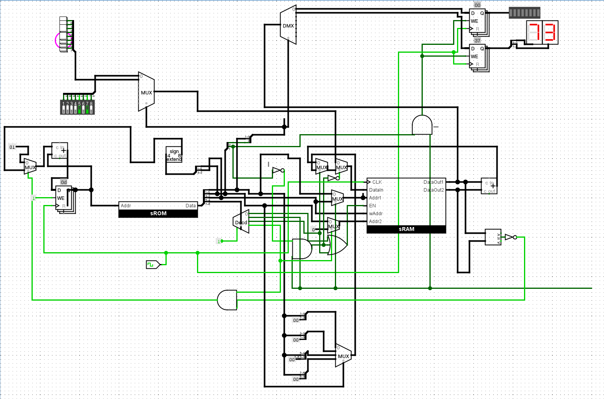

> [!NOTE]
> 做着做着发现文档更新成26.07了，去掉了原来很长的RISCV的部分，不用在F阶段啃手册了。
>
> 不过F5之前的东西都没有变，PC从4位变成了8位需要注意一下。

# sISA指令拓展

```
 7  6 5  4 3   2 1   0
+----+----+-----+-----+
| 00 | rd | rs1 | rs2 | R[rd]=R[rs1]+R[rs2]
+----+----+---+-+-----+
| 01 | rd |i/o|  idx  | R[rd]<=>dev[idx]
+----+----+---+-+-----+
| 10 | rd |  s  | imm | R[rd]=imm << (s << 1)
+----+----+-----+-----+
| 11 |  offset  | rs2 | if (R[0]!=R[rs2]) PC=PC+sign_ext(offset)
+----+----------+-----+
```

需要将sISA的指令拓展为如上所示。

> 修改sCPU的实现, 让其支持增强版本的li指令和bner0指令.
然后修改数列求和程序的指令序列, 让程序使用增强后的指令来计算1+2+...+10. 让sCPU运行修改后的数列求和程序, 检查求和的结果是否正确.

实现li


实现bner0


让我们重新编写数列求和程序。

```
li r0 1 2  // r0 = 8
li r1 0 2  // r1 = 2
add r0 r1 r0 // r0 = 10
li r1 0 0
li r2 0 0
li r3 0 1
add r1, r1, r3
add r2, r2, r1
bner0 -2 r1
bner0 0 r3
```
对应的二进制列
```bin
10000110
10010010
00000100
10010000
10100000
10110001
00010111
00101001
11111001
11000011
```

# 让sCPU支持输入输出

> 在sCPU中添加io指令, 使得io指令可以控制LED.
然后修改数列求和程序的指令序列, 让程序通过io指令将计算结果输出到LED, 并检查LED的亮灭情况是否符合预期.

```
li r0 1 2       ; r0 = 8
li r1 0 2       ; r1 = 2
add r0 r1 r0    ; r0 = 10
li r1 0 0
li r2 0 0
li r3 0 1
add r1, r1, r3
add r2, r2, r1
bner0 -2 r1
io r2 1 0
bner0 0 r3
```
对应的二进制列
```bin
10000110
10010010
00000100
10010000
10100000
10110001
00010111
00101001
11111001
01101000
11000011
```


> 完善io指令的实现, 使得io指令可以控制七段数码管. 和LED类似, 你还需要为七段数码管添加一个输出数据寄存器.
然后修改数列求和程序的指令序列, 让程序通过io指令将计算结果输出到七段数码管, 并检查七段数码管的显示情况是否符合预期. 注意Hex Digit Display组件显示的是十六进制.

同理

>  从拨码开关中读入数列的末项
完善io指令的实现, 使得io指令可以从拨码开关中读入数据到GPR中.然后修改数列求和程序的指令序列, 让程序通过io指令从拨码开关中读入末项, 并通过LED或七段数码管检查计算结果是否符合预期.

```
io r0 0 0
li r1 0 0
li r2 0 0
li r3 0 1
add r1, r1, r3
add r2, r2, r1
bner0 -2 r1
io r2 1 0
bner0 0 r3
```
对应的二进制列
```bin
01000000
10010000
10100000
10110001
00010111
00101001
11111001
01101000
11000011
```

>  通过按钮控制结果的显示
完善io指令的实现, 使得io指令可以从按钮中读入数据到GPR中.
然后修改数列求和程序的指令序列, 让循环过程中将当前的项输出到LED, 并在计算完成后, 先不断查询按钮的状态, 直到有按钮被按下, 七段数码管才显示计算的结果. 检查按钮的行为是否符合预期.

```
io  r0 0 0      
li  r1 0 0      
li  r2 0 0      
li  r3 0 1      
add r1 r1 r3    
io  r1 1 0      
add r2 r2 r1    
bner0 -3 r1     
li  r1 0 0      ; R1 清零，用于按钮轮询比较
io  r0 0 1      ; 读按钮到 R0
bner0 +2 r1     ; 按钮 != 0
bner0 -2 r3     ; 按钮 == 0
io  r2 1 1      
bner0 0 r1      
```
二进制
```bin
0b01000000
0b10010000
0b10100000
0b10110001
0b00010111
0b01011000
0b00101001
0b11110101
0b10010000
0b01000001
0b11001001
0b11111011
0b01101001
0b11000001
```

完成


> 实现单步求和
修改数列求和程序的指令序列, 同时实现以下效果:
在每次循环中, 将当前的项输出到LED, 将当前的求和结果输出到七段数码管
用按钮来控制循环的进度, 仅当每次按下表示最低位的按钮时, 程序才进入下一次循环
也即, 运行程序时, LED和七段数码管首先显示1和1; 用户按下表示最低位的按钮后, LED和七段数码管显示2和3; 用户按下表示最低位的按钮后, LED和七段数码管显示3和6......
由于GPR的数量只有4个, 而且bner0指令中能容纳的偏移范围只有-8~7, 因此你可能需要精心设计GPR的使用方式, 来尽可能减少循环中的指令数量, 使得bner0跳转目标的偏移不超过指令的表示范围.
Hint: 存在一种只需要12条指令的解决方案.

思路是在读取完输入后用io和bner0等待按钮输入，输入后进行正常累加，然后跳转回到等待前。

# F6

虽然我们在Logisim中成功搭建了一个拥有程序执行功能的简单处理器，但是Logisim的设计是很麻烦的，而且其中有很多步骤完全可以自动化执行，设计人员只需要负责设计。

在计算机诞生之初，没有任何电子自动化工具（EDA），处理器的逻辑设计、电路版图完全由研发人员手绘而成，比较有名的有英特尔的Intel 4004，由[Federico Faggin](https://en.wikipedia.org/wiki/Federico_Faggin)设计。

随着摩尔定律的生效，ISA变得越来越复杂，芯片进入大规模（LSI）以及超大规模集成电路（VLSI），手工设计越来越困难，一旦流片失败将造成极大的成本压力。在1980年，[Carver Mead](https://en.wikipedia.org/wiki/Carver_Mead)和[Lynn Conway](https://en.wikipedia.org/wiki/Lynn_Conway)（值得一提的是Conway还是一名跨性别者）发表了《超大规模集成电路系统导论》（Introduction to VLSI Systems），提出了使用编程语言进行芯片设计的新思想，并在之后谈生了Verilog、VHDL等硬件描述语言。实际上这些语言一开始是作为模拟和仿真验证使用，即使如此也极大降低了成本。

在之后Synopsys等公司发明了逻辑综合器（即将硬件描述语言转化为逻辑门电路），HDL逐渐成为设计工具，并影响到ISA的设计哲学。得益于HDL工具的综合能力对简洁清晰代码的支持，精简指令集（RISC）得到广泛的认可，也使得芯片设计的门槛在一定程度上降低。

回顾整个历史，处理器硬件的发展离不开软件的支持，计算机性能的提升使得开发更复杂的软件成为可能，而软件的诞生刺激硬件的发展，并诞生了有利于设计更优秀处理器的软件工具，颇有一些左脚踩右脚的感觉。随着软件和硬件联系的加深，诞生了[Chisel](https://www.chisel-lang.org/)这类拥有高级编程语言思想的HDL甚至可以将高级语言“翻译”成HDL的高层次综合（HLS）工具。硬件设计需要重视软件发挥的作用，更需要一些软件工程的思想。